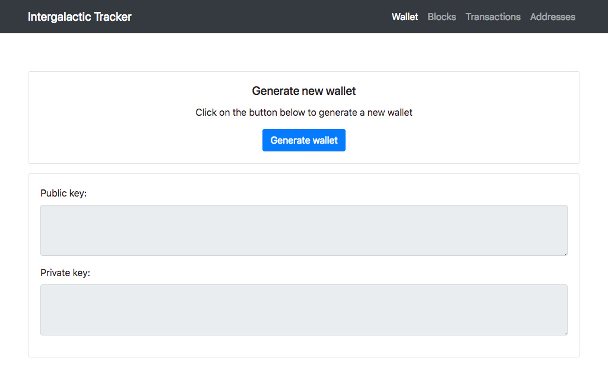

# Intergalactic Tracker

## Requirements

### Virtualenv

Check your Python version (we recommend to use Python 3.7)

```
$ python3 --version
```

Make a virtualenv and activate it

```
$ python3 -m venv .
$ source bin/activate
```

### Python packages

Install Python packages

```
$ pip3 install -r requirements.txt
$ pip3 install -e .
```

## Usage

Run the tracker interface

```
$ python src/tracker/app.py
```


